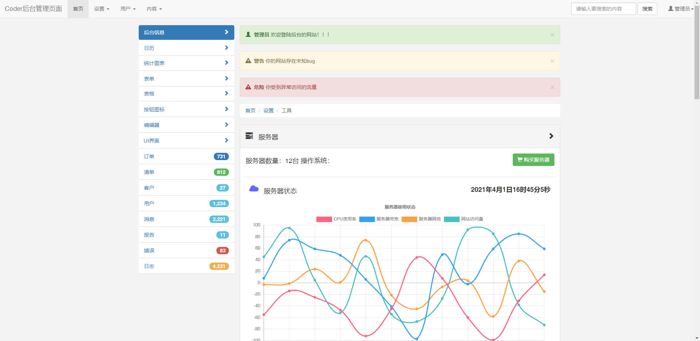

# Coder

​		这是一个使用bootstrap3构建的响应式静态网页项目。Coder 是以程序员为主题的网站、主要内容包括：编程语言相关的网站的推荐、介绍各种各样编程语言的特点、爱好编程、精通于计算机的技术等。

## 技术选型

- bootstrap3

- html+html5+css+css3

- JS + jQuery

- 图标效果：阿里 icon + bootstrap3图标

- 动效效果：animate.js + Hover.js + wow.js + charts 数据表

## 项目结构

```bash
index.html // 首页内容 
login.html // 登陆/注册页面
admin.html // 后台登陆页面 
```

## 效果截图

#### 首页


#### 后台管理页



#### 登陆页


## 需求分析

- 基于 boostrap3 开发的 Web 响应式的网页
- 后台数据模板可视化
- 滚动数字更换的效果

## 更新内容

- [x] 完成首页的编写
- [x] 完成登陆的编写
- [x] 完成后台页面的编写
- [ ] 创建数据库
- [ ] 编写后台接口内容

## 浏览器兼容性

- 浏览器测试版本：google版本：83.0.4103.97
- 其他版本的浏览器没有测试过，可能存在一定的差异